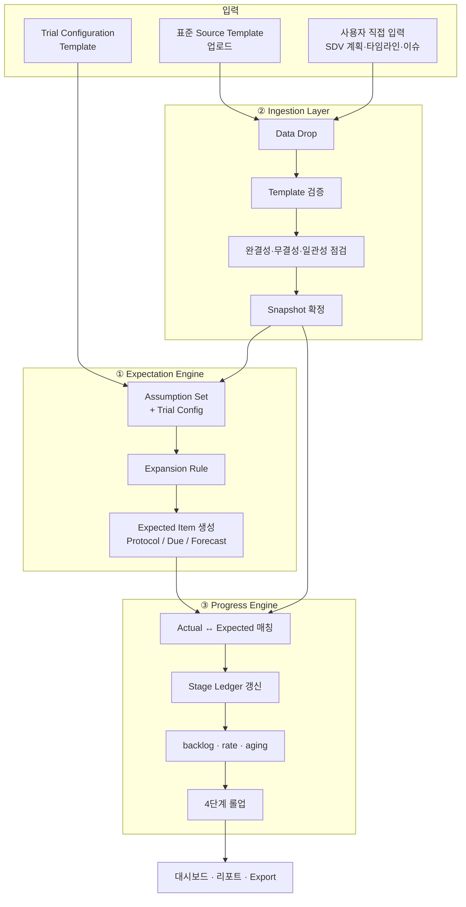
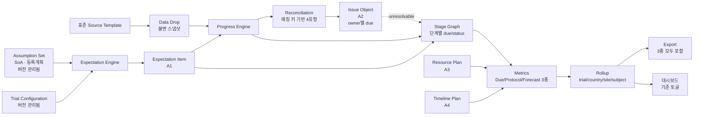

# 03. 핵심 개념 모델

> **이 문서가 개념 설계의 중심입니다.** 나머지 문서는 모두 여기서 정의한 개념의 적용입니다.
>
> *개정 이력: v2 (검토 반영 — Due 기준 3종 토글, 상태 통합, 유예 기간 재정의, EDC 병행 단계, Reconciliation 재정의)*

## 1. 출발점: 여섯 도메인은 사실 네 가지다

요구사항의 여섯 도메인을 나란히 놓고 보면 겉모습은 제각각입니다. 하지만 각 항목이 **무엇을 세고 무엇을 추적하는지**를 기준으로 분해하면, 반복되는 네 개의 패턴만 남습니다.

| 아키타입 | 정체 | 추적 방식 | 해당 요구사항 |
|---|---|---|---|
| **A1. Expectation Item** | 나와야 할 개별 개체 | 순서 있는 **단계 그래프**를 따라 진행 | EDC 폼(a~b, d~h), 방문(RTSM c~d), 샘플(a~e, g), 이미지(a~d, g) |
| **A2. Issue Object** | 해결되어야 할 문제 | 열림 → 응답 → 종결 + **기한과 경과일** | 쿼리(EDC c), 샘플 이슈(f), 이미지 이슈(f) |
| **A3. Resource Plan** | 계획된 자원 투입 | 계획 대비 실적 + **용량 적정성 평가** | SDV 방문 계획(D3 전체) |
| **A4. Timeline Plan** | 계획된 시점 | 계획일 대비 실제일 + **차이(variance)** | 마일스톤, 상세 task(D6 전체) |

이 네 가지가 개념 커널입니다. 도메인별 로직을 따로 만들지 않고, 네 아키타입의 공통 엔진 위에 **도메인 설정(configuration)** 을 얹는 것이 이 설계의 핵심 판단입니다.

### 1.1 왜 이것이 중요한가

EDC의 요구사항 a~h는 **7개의 서로 다른 지표가 아니라 동일한 폼 인스턴스가 거쳐 가는 7개의 단계**입니다. 같은 구조가 샘플과 이미지에도 그대로 나타납니다.

```
EDC    : 입력 → (SDV · 리뷰 · 코딩 · freeze · 서명) → lock
Sample : 채취 → central lab 도착 → bioanalytics 도착 → 분석
Image  : 획득 → BICR 업로드 → QC → 배정 → 판독
```

셋 다 동일한 구조입니다. 하나의 개체가 단계를 통과하며, 각 단계마다 "여기까지 왔어야 하는데 안 온 것"이 backlog가 됩니다. 이 통찰이 데이터 모델([06](06-logical-data-model.md))과 코드 구조 전체를 단순하게 만듭니다.

## 2. 세 개의 엔진



### 2.1 ① Expectation Engine — 무엇이 나와야 하는가

가정과 시험 설정을 받아 개별 기대 항목을 생성합니다. 이 앱의 고유 가치가 여기 있습니다.

| 입력 | 내용 | 출처 |
|---|---|---|
| SoA | 방문별 수행 폼·샘플·이미지 목록 | 표준 template ([12](12-standard-source-templates.md)) |
| 방문 스케줄 | 기준일로부터의 목표일과 윈도우 | 표준 template |
| 등록 계획 | 국가·사이트별 목표 수와 등록 곡선 | 표준 template |
| **Trial Configuration** | 유예 기간, partial SDV 여부, 단계 on/off, 대상 피험자 목록 등 | **설정 template** ([13](13-trial-configuration.md)) |

### 2.2 ② Ingestion Layer — 무엇이 실제로 들어왔는가

**표준 source dataset template**을 통해 데이터를 받습니다. 앱의 입력 경계는 vendor 원본 파일이 아니라 **vendor data로 사내에서 이미 만들고 있는 표준 파일**(external data reconciliation file 등)입니다. vendor 형식 변동이 표준화 단계에서 흡수되므로 앱은 영향을 받지 않습니다. 상세는 [12](12-standard-source-templates.md)입니다.

핵심 개념은 **Data Drop**입니다. 파일 한 번의 업로드가 Data Drop 한 건이고, 이것이 불변 단위로 보존됩니다.

### 2.3 ③ Progress Engine — 무엇이 밀려 있는가

기대 항목과 실제 항목을 매칭하고, 단계별 상태를 갱신하며, 지표를 계산합니다. 모든 계산식은 [15](15-metric-specification.md)에 재현 가능한 형태로 명세됩니다.

## 3. Expectation Item의 생애 (A1 상세)

### 3.1 Stage Graph 모델

Expectation Item은 도메인별로 정의된 **단계 그래프**를 가집니다. 선형이 아니라 그래프인 이유는 EDC처럼 여러 단계가 병행되는 경우가 있기 때문입니다.

#### EDC Form

```
expected → entered ──┬──> SDV'd   ──┐
                     ├──> reviewed ─┤
                     ├──> coded   ──┼──> locked
                     ├──> frozen  ──┤
                     └──> signed  ──┘
                     (5개 단계 병행)
```

`entered` 이후의 다섯 단계는 **서로 선후 관계가 없으며 독립적으로 진행**됩니다. 각 단계는 자기 분모와 자기 유예 기간을 가집니다. `locked`만 전 단계 완료를 전제로 합니다.

#### Sample

```
expected → collected → received(central lab) → received(bioanalytics lab) → assigned → analyzed
```

#### Image

```
expected → taken → uploaded(BICR) → QC passed → assigned → read
```

#### Visit

```
expected → occurred
```

### 3.2 단계별 요구 여부 — 분모가 단계마다 다르다

모든 폼이 모든 단계를 거치지는 않습니다.

- SDV 대상은 partial SDV 설정에 따라 일부 폼·일부 피험자만일 수 있습니다.
- Medical coding 대상은 AE, CM, MH 등 특정 폼에 한정됩니다.
- Data review는 **시험에 따라 적용하지 않을 수 있습니다** (3.5 참조).

따라서 단계마다 분모가 따로 계산됩니다.

```
due_population(stage) = { item | item.is_due(stage)
                                 AND stage_scope_rule(stage).applies(item)
                                 AND trial_config.stage_enabled(stage) }
```

### 3.3 단계 상태 사다리

각 항목·단계 조합은 다음 중 하나의 상태를 가집니다.

| 상태 | 의미 | 분모 포함 |
|---|---|---|
| `NOT_APPLICABLE` | 이 단계가 이 항목에 적용되지 않음 | 제외 |
| `NOT_DUE` | 적용되나 아직 기한이 오지 않음 | 제외 |
| `PENDING` | 기한이 도래했고 유예 기간 내 | **포함** |
| `OVERDUE` | 유예 기간을 초과 | **포함** |
| `DONE` | 완료 | **포함** |
| `WAIVED` | **예외 처리** — 사유 필수 | **제외** |

#### WAIVED의 통합 (검토 반영)

초안에서 `BLOCKED`(해결 불가 이슈로 차단)와 `WAIVED`(의도적 면제)를 분리했으나, **둘 다 결국 예외 사항을 나타내므로 `WAIVED`로 통일**합니다.

`WAIVED`는 **분모에서 제외**됩니다. 해결될 수 없는 항목을 backlog에 남겨두면 지표가 영구히 왜곡되고, 사이트 간 비교도 불가능해지기 때문입니다.

다만 예외의 성격은 구분해서 기록합니다. 원인을 분석하려면 필요하기 때문입니다.

| `waiver_type` | 의미 | 예시 |
|---|---|---|
| `ISSUE_BLOCKED` | 해결 불가 이슈로 진행 불가 | 샘플 분실, 용혈로 분석 불가, 영상 소실 |
| `PROTOCOL_EXEMPT` | 프로토콜상 해당 없음으로 확인됨 | 조건 미충족으로 미수행 |
| `OPERATIONAL_WAIVER` | 운영상 면제 결정 | DBL 범위 제외 합의 |

`WAIVED` 처리에는 **사유 입력이 필수**이며 감사 추적에 기록됩니다. 예외 건수와 사유별 분포는 별도 지표로 제공합니다. 예외가 많다는 것 자체가 중요한 신호이기 때문입니다.

### 3.4 Expected의 세 기준과 토글 (검토 반영)

`expected`를 무엇으로 정의하는가가 모든 지표의 의미를 결정합니다. **세 기준을 모두 계산해 두고, 사용자가 토글 버튼으로 전환**합니다.

| 기준 | 분모 정의 | 용도 |
|---|---|---|
| **Due-expected** (기본) | 선행 조건이 충족되어 **지금 나와야 하는** 항목 | 운영 관리. 정상 상태의 목표가 100% |
| **Protocol-expected** | 프로토콜상 시험 전체에서 나올 모든 항목 | 총량 계획, DBL 규모 산정 |
| **Forecast-expected** | 지정 시점까지 나올 것으로 예측되는 항목 | 리소스 계획, SDV 물량 예측 |

```
┌────────────────────────────────────────────────────┐
│  분모 기준:  [ Due ]  [ Protocol ]  [ Forecast ▸ ] │
│              ▲ 기본                    기준일 지정  │
└────────────────────────────────────────────────────┘
```

**설계 규칙.** 세 값은 모두 저장됩니다. 토글은 조회 시점의 표시 전환일 뿐 재계산을 유발하지 않으며, 따라서 즉시 반응합니다. Export 시에는 **세 값이 모두 별도 컬럼으로 포함**되어, 외부 BI 도구에서도 동일한 전환이 가능합니다.

### 3.5 Due 규칙과 유예 기간 (검토 반영)

모든 유예 기간은 **달력일(calendar days)** 기준이며, **시험별로 설정 가능**합니다 ([13](13-trial-configuration.md)). 아래는 기본값입니다.

#### EDC

| 단계 | Due 트리거 | 기본 유예 기간 | 비고 |
|---|---|---|---|
| entry | 방문 발생일 | **+14일** | |
| SDV | 폼 입력 완료 + SDV 범위 해당 | **+60일** | partial SDV 설정 적용 |
| data review | 폼 입력 완료 | **+30일** | **시험별 적용 여부 설정** (아래) |
| medical coding | 해당 폼 입력 완료 | **+60일** | |
| investigator sign | — | **유예 기간 없음** | **특수 처리** (아래) |
| freezing | 서명 완료 | DBL 계획 기준 | |
| locking | freeze 완료 | DBL 계획 기준 | |

**data review의 시험별 적용 여부.** Data review flagging을 운영하지 않는 시험이 있습니다. 이 경우 지표 자체가 무의미하므로, `trial_config.stages.data_review.enabled = false`로 두면 **화면·집계·export에서 해당 단계가 완전히 제외**됩니다. 0%로 표시되어 오해를 부르는 일이 없어야 합니다.

**investigator sign의 특수 처리.** 서명 여부는 audit trail 이력을 통해서만 정확히 파악되므로 유예 기간 개념을 적용하기가 현실적으로 어렵습니다. 따라서 이 단계만 다르게 다룹니다.

- 유예 기간을 두지 않으며 `OVERDUE` 상태를 사용하지 않습니다.
- **미서명 건수(sign pending)만 집계**합니다.
- 집계는 **전체 데이터**와 **SAE 데이터** 두 구분으로 각각 산출합니다.

```
sign_pending_all = count(sign 미완료 폼, 전체)
sign_pending_sae = count(sign 미완료 폼, SAE 해당)
```

#### Sample

| 단계 | Due 트리거 | 기본 유예 기간 | 비고 |
|---|---|---|---|
| collected | 방문 발생일 | +0일 | |
| received (central lab) | **채취일** | **+30일** | 사이트 출고일을 알 수 없는 경우가 많아 채취일을 기준으로 함 |
| received (bioanalytics lab) | central lab 도착일 | 설정값 | |
| analyzed | bioanalytics 도착일 | 설정값 | |

#### Image

| 단계 | Due 트리거 | 기본 유예 기간 |
|---|---|---|
| **taken** | 획득 예정일 (방문 발생일) | **+0일** |
| uploaded (BICR) | 획득일 | **+14일** |
| QC passed | 업로드일 | 설정값 |
| read | 배정일 | 설정값 |

#### Query (A2에 Due 개념 도입)

초안에서 쿼리는 기한 없이 경과일만 추적했으나, 검토 결과 **쿼리에도 기한을 둡니다**.

| 대상 | Due 트리거 | 기본 유예 기간 |
|---|---|---|
| open query | 쿼리 생성일 | **+14일** |
| answered query | 쿼리 생성일 | **+30일** |

**쿼리 소유자별 차등 설정.** 기능팀마다 응답 기대 시간이 다르므로, 소유자별 유예 기간을 따로 설정할 수 있습니다. 기본값은 다음과 같습니다.

| Query owner | 기본 유예 기간 |
|---|---|
| PV (Pharmacovigilance) | **+7일** |
| DM (Data Management) | **+14일** |
| MM (Medical Monitor) | **+30일** |
| CRA | **+60일** |

소유자 목록과 각 기간은 시험별 설정 항목입니다. 설정되지 않은 소유자는 위 open/answered 기본값을 따릅니다.

### 3.6 파생 지표 공식 (검토 반영)

```
backlog(stage)   = count(status ∈ {PENDING, OVERDUE})
completed(stage) = count(status ∈ {DONE})
due(stage)       = backlog(stage) + completed(stage)
rate(stage)      = completed(stage) / due(stage)          # due = 0 이면 N/A
overdue(stage)   = count(status = OVERDUE)
waived(stage)    = count(status = WAIVED)                 # 분모 밖, 별도 집계
aging(stage)     = as_of_date - due_date                   # 항목별. 집계 시 중앙값·90퍼센타일·구간 분포
```

`WAIVED`는 `backlog`에도 `completed`에도 들어가지 않으므로 `due`에서 자동으로 제외됩니다. 대신 `waived`로 따로 집계되어 화면에 병기됩니다.

이 일곱 줄이 요구사항 D1의 a~h(서명 제외), D4의 a~e·g, D5의 a~d·g를 전부 생성합니다. 도메인별로 바뀌는 것은 단계 그래프 정의와 Due 규칙, 매칭 키뿐입니다. 정식 명세는 [15](15-metric-specification.md)에 있습니다.

## 4. Issue Object의 생애 (A2 상세)

### 4.1 공통 구조

| 속성 | 설명 |
|---|---|
| 상태 | `OPEN → ANSWERED → CLOSED` (+ `CANCELLED`) |
| **소유자(owner)** | 응답 책임 기능팀. 유예 기간 차등의 기준 (3.5) |
| 분류 그룹 | 요구사항 D1-c의 "query group별 개별 조회" 축 |
| 대상 | 어느 Expectation Item 또는 어느 피험자에 붙었는가 |
| **due_date** | 생성일 + 소유자별 유예 기간 |
| 발생·응답·종결 시각 | aging 계산의 기준 |
| 예외 여부 | 해결 불가로 판정 시 대상 항목을 `WAIVED`로 전이 |

### 4.2 지표

```
total / open / answered / closed              # 요구사항 D1-c
overdue_open     = count(open,     as_of > due_date)
overdue_answered = count(answered, as_of > due_date)
aging            = as_of - opened_at
resolution cycle time = closed_at - opened_at
```

모든 지표는 **소유자별·그룹별로 분해 가능**합니다.

### 4.3 Issue와 Item의 연결

요구사항 D4-f, D5-f의 "해결 불가능하며 업무에 영향을 주는 이슈"를 표현합니다. 초안의 `BLOCKED` 상태가 `WAIVED`로 통합되었으므로 연결도 다음과 같이 바뀝니다.

```
Issue(unresolvable = true)  →  Item.stage_status = WAIVED
                               Item.waiver_type  = ISSUE_BLOCKED
                               Item.waiver_reason ← Issue 내용 참조
```

이 전이는 **자동으로 일어나지 않습니다.** 담당자가 "해결 불가"로 판정해야 하며, 그 판정 자체가 감사 추적에 기록됩니다. 분모에서 항목을 빼는 결정이므로 근거가 남아야 하기 때문입니다.

## 5. Reconciliation — 불일치의 정의 (검토 반영)

### 5.1 입력이 이미 대조된 파일이어도 앱은 자체 판정한다

사내 표준 파일(external data reconciliation file)에는 보통 대조 결과가 이미 들어 있습니다. 그래도 **앱은 그 결과를 그대로 받아들이지 않고, 파일에 담긴 양측 원시값으로 자체 판정한 뒤 두 결과를 비교합니다.**

```
표준 파일 1행
  ├─ EDC측 원시값     ──┐
  ├─ vendor측 원시값  ──┼──> 앱의 자체 판정 (5.2~5.3의 유형)
  └─ 파일의 대조 결과 ──┴──> 비교 → 불일치는 별도 목록으로 보고
```

근거는 재현 가능성입니다. 외부에서 만들어진 판정을 수입하면 그 숫자는 [15](15-metric-specification.md)의 계산식 명세 바깥에 놓여 앱이 재현할 수 없습니다. 또한 두 판정의 불일치는 그 자체로 확인 가치가 있는 정보입니다.

DP-12-8 확정에 따라 **사내 표준 파일에는 대조에 사용되는 양측 원시값이 포함**되므로, 앱은 항상 자체 판정이 가능합니다. "판정 수입" 상태 표시는 이 전제가 깨지는 경우에 대한 안전장치로 유지합니다 ([12](12-standard-source-templates.md) 5.6).

형식의 상세는 [16](16-external-data-format-draft.md)에 있습니다.

### 5.2 매칭 키 입도가 먼저다

불일치 유형을 정의하기 전에 **무엇을 기준으로 매칭하는가**를 확정해야 합니다. 이것이 결정되지 않으면 불일치 판정 자체가 틀립니다.

검토에서 지적된 사례가 정확히 이 문제입니다. 샘플을 `subject_ID + visit`만으로 매칭하면, **kit 유형(PK/ADA/NAB)이 구분되지 않아 해당 방문에 샘플이 있는 것으로 혼동**됩니다. PK만 도착하고 ADA는 오지 않았는데 "그 방문의 샘플은 왔다"고 판정되는 것입니다.

따라서 각 Feed마다 **매칭 키를 명시적으로 선언**하며, 이것은 표준 template의 필수 메타데이터입니다 ([12](12-standard-source-templates.md)).

| 도메인 | 권고 매칭 키 | 불충분한 키의 위험 |
|---|---|---|
| Sample | `kit_type(PK/ADA/NAB) + subject_id + visit + **nominal timepoint**` (+ 재채취 순번) | kit 유형이 빠지면 유형별 누락을 놓치고, **timepoint가 빠지면 같은 방문의 PK 다중 시점이 구분되지 않음** ([16](16-external-data-format-draft.md) 1.2) |
| EDC Form | `subject_id + visit + form + (repeat_seq)` | 반복 폼 구분 실패 |
| Image | `subject_id + visit + modality` | 검사 종류별 누락을 놓침 |

매칭 키의 입도가 소스보다 거칠면 앱은 **경고를 표시하고 해당 Feed의 reconciliation을 신뢰도 낮음으로 표시**합니다. 조용히 틀린 답을 내는 것보다 낫습니다.

### 5.3 샘플 불일치 유형 (재정의)

| 유형 | 정의 |
|---|---|
| **`EDC_Y_NOT_RECEIVED`** | EDC에서 sample collection = Y 이나, central lab 또는 bioanalytics lab에 없음 |
| **`RECEIVED_NOT_IN_EDC`** | central lab 또는 bioanalytics lab에는 있으나, EDC에서 collection = N 이거나 값이 없음 |
| **`MATCHED_DISCREPANT`** | 매칭은 되나 샘플 정보가 불일치 (채취일, kit 유형, 방문 등) |
| **`AMBIGUOUS_MATCH`** | 매칭 후보가 여럿이어서 특정 불가 |

앞의 두 유형은 방향이 반대인 동일한 대조이며, **각각 다른 후속 조치**로 이어집니다. 전자는 검체 추적(배송 중 분실 여부 확인)이고, 후자는 EDC 데이터 정정입니다. 그래서 하나로 합치지 않고 분리합니다.

각 유형은 **어느 랩 구간에서 발생했는지**(central / bioanalytics)를 함께 기록하여, 어느 물류 구간이 문제인지 드러나게 합니다.

### 5.4 EDC·Image 불일치 유형

같은 4유형 구조를 각 도메인의 용어로 적용합니다.

| 도메인 | 유형 1 | 유형 2 | 유형 3 | 유형 4 |
|---|---|---|---|---|
| Image | EDC에 영상 평가 기록 있으나 BICR에 영상 없음 | BICR에 영상 있으나 EDC에 해당 기록 없음 | 획득일·검사 방법 불일치 | 매칭 후보 다수 |
| EDC ↔ RTSM | RTSM에 방문 있으나 EDC에 폼 없음 | EDC에 폼 있으나 RTSM에 방문 없음 | 방문일 불일치 | 방문 식별 모호 |

### 5.5 Reconciliation 상태

```
reconciliation status = ALL_RECONCILED   if 미해결 불일치 = 0
                      = PENDING_ISSUE    otherwise
```

미해결 건수는 유형별·랩별·사이트별로 분해됩니다.

## 6. 롤업 — 4단계 집계

### 6.1 계층

```
Trial ─┬─ Country ─┬─ Site ─┬─ Subject ─┬─ Visit ─┬─ Item(Form/Sample/Image)
```

### 6.2 롤업 규칙

**집계는 항상 개별 항목 수준에서 시작하여 합산**합니다. 상위 레벨의 비율을 하위 레벨 비율의 평균으로 계산하지 않습니다.

```
올바름:  trial_rate = Σ completed / Σ due
잘못됨:  trial_rate = mean(site_rate)
```

사이트 간 성과 비교에는 사이트별 비율이 필요하므로 둘 다 제공하되 이름을 명확히 구분합니다 (`overall rate` vs `site average rate`).

### 6.3 레벨별 가용성

| 도메인 | Trial | Country | Site | Subject |
|---|---|---|---|---|
| D1 EDC | O | O | O | O |
| D2 RTSM | O | O | O | O |
| D3 SDV plan | O | O | O | — |
| D4 Sample | O | O | O | O |
| D5 Image | O | O | O | O |
| D6 Timeline | O | — | — | — |

## 7. 시간 축 — 재현 가능성의 기반

### 7.1 세 개의 시간

| 시간 | 의미 | 용도 |
|---|---|---|
| **Event time** | 업무 사실이 실제 일어난 시각 (방문일, 채취일) | 업무 분석 |
| **Valid time** | 그 사실이 유효한 기간 | 정정 이력 추적 |
| **System time** | 앱이 그것을 알게 된 시각 (Data Drop 시각) | 재현, 감사 |

### 7.2 계산 좌표

모든 지표는 다음 좌표에서 계산됩니다.

```
metric_value = f(metric_definition_version,
                 snapshot_version,
                 assumption_version,
                 trial_config_version,
                 expected_basis,          # Due | Protocol | Forecast
                 as_of_date,
                 filter)
```

화면 상단에는 항상 이 좌표가 표시됩니다. 표시 없는 숫자는 만들지 않습니다. `trial_config_version`이 좌표에 포함된 것이 검토 반영 사항입니다. 유예 기간이나 단계 on/off가 바뀌면 지표가 바뀌므로, 설정도 버전 관리 대상입니다.

### 7.3 왜 이것이 중요한가

이 개념이 없으면 "지난주 회의 자료의 숫자가 왜 지금과 다른가"에 답할 수 없습니다. 답할 수 없는 지표는 회의에서 신뢰를 잃고, 사람들은 다시 각자 엑셀로 돌아갑니다. **재현 가능성은 부가 기능이 아니라 이 앱이 채택되기 위한 조건**입니다. 계산식의 정식 명세는 [15](15-metric-specification.md)에 있습니다.

## 8. 개념 모델 요약도



## 9. 검토 반영 요약 (v1 → v2)

| 항목 | v1 | v2 |
|---|---|---|
| 분모 기준 | Due 기본, 3종 계산 | 동일 + **사용자 토글 전환** (3.4) |
| 예외 상태 | `BLOCKED` + `WAIVED` 분리 | **`WAIVED`로 통합**, 분모에서 제외, `waiver_type`으로 성격 구분 (3.3) |
| 유예 기간 | 영업일 혼용, 임시값 | **달력일 기준, 실무값으로 재정의** (3.5) |
| investigator sign | 일반 단계와 동일 | **유예 기간 없이 pending 건수만, 전체/SAE 구분** (3.5) |
| data review | 항상 적용 | **시험별 on/off** (3.5) |
| sample 중앙랩 도착 | 사이트 출고일 기준 | **채취일 기준 +30일** (3.5) |
| image | `acquired` 단계 | **`taken`(+0일) / `uploaded`(+14일)** 로 명확화 (3.5) |
| query | 기한 없음 | **open +14일 / answered +30일, 소유자별 차등** (3.5) |
| EDC 단계 | 7단계 선형 | **입력 후 5단계 병행 → lock** (3.1) |
| backlog 공식 | `BLOCKED` 포함 | **`PENDING`+`OVERDUE`만** (3.6) |
| Reconciliation | 일반 4유형 | **매칭 키 입도 선언 + 샘플 기준 재정의** (5장) |
| 입력 경계 | vendor 원본 파일 | **vendor data로 만든 사내 표준 파일** (2.2, 5.1) |

## 10. 검토 포인트 (Decision Points)

| # | 결정 필요 사항 | 기본 제안 |
|---|---|---|
| DP-03-7 | 3.3의 `waiver_type` 3분류가 충분한가 | 충분, 설정으로 확장 가능 |
| DP-03-8 | 3.5 sample `received(bioanalytics)`, `analyzed`의 기본 유예 기간 값 | 실무 확인 필요 |
| DP-03-9 | 3.5 image `QC passed`, `read`의 기본 유예 기간 값 | 실무 확인 필요 |
| DP-03-10 | 3.5 쿼리 소유자 구분(DM/CRA/MM/PV) 외에 추가할 소유자가 있는가 | 설정 목록으로 확장 |
| DP-03-11 | 5.2의 매칭 키 입도가 불충분할 때 "신뢰도 낮음" 표시로 충분한가, 아니면 업로드를 거부할 것인가 | **경고 후 진행** 권고 |
| DP-03-13 | 5.1의 "앱 자체 판정 우선" 원칙에 동의하는가 | **동의 권고** — 재현 가능성의 전제 |
| DP-03-12 | investigator sign의 SAE 구분 기준을 무엇으로 판정하는가 (폼 종류 / 플래그 / AE 심각도) | 표준 template의 명시 필드로 |
