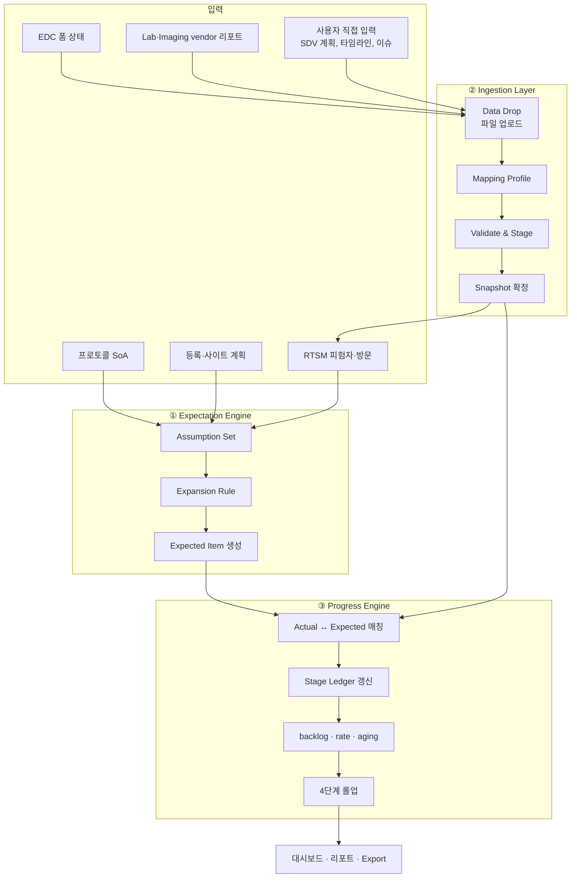
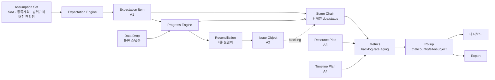

# 03. 핵심 개념 모델

> **이 문서가 개념 설계의 중심입니다.** 나머지 문서는 모두 여기서 정의한 개념의 적용입니다.

## 1. 출발점: 여섯 도메인은 사실 네 가지다

요구사항의 여섯 도메인을 나란히 놓고 보면 겉모습은 제각각입니다. 하지만 각 항목이 **무엇을 세고 무엇을 추적하는지**를 기준으로 분해하면, 반복되는 네 개의 패턴만 남습니다.

| 아키타입 | 정체 | 추적 방식 | 해당 요구사항 |
|---|---|---|---|
| **A1. Expectation Item** | 나와야 할 개별 개체 | 순서 있는 **단계 체인**을 따라 진행 | EDC 폼(a~b, d~h), 방문(RTSM c~d), 샘플(a~e, g), 이미지(a~d, g) |
| **A2. Issue Object** | 해결되어야 할 문제 | 열림 → 응답 → 종결 + **경과일(aging)** | 쿼리(EDC c), 샘플 이슈(f), 이미지 이슈(f) |
| **A3. Resource Plan** | 계획된 자원 투입 | 계획 대비 실적 + **용량 적정성 평가** | SDV 방문 계획(D3 전체) |
| **A4. Timeline Plan** | 계획된 시점 | 계획일 대비 실제일 + **차이(variance)** | 마일스톤, 상세 task(D6 전체) |

이 네 가지가 개념 커널입니다. 도메인별 로직을 따로 만들지 않고, 네 아키타입의 공통 엔진 위에 **도메인 설정(configuration)** 을 얹는 것이 이 설계의 핵심 판단입니다.

### 1.1 왜 이것이 중요한가

EDC의 요구사항 a~h를 순서대로 보십시오.

```
a. entry          b. SDV           d. data review    e. medical coding
f. investigator sign    g. freezing    h. locking
```

이것은 **7개의 서로 다른 지표가 아닙니다**. 동일한 폼 인스턴스 하나가 거쳐 가는 **7개의 단계**입니다. 폼 하나가 입력되고, SDV되고, 리뷰되고, 코딩되고, 서명되고, freeze되고, lock됩니다. 지금까지 이것들이 별개 지표로 보였던 이유는 리포트가 단계별로 따로 나왔기 때문이지, 개체가 달라서가 아닙니다.

같은 구조가 샘플에도 그대로 나타납니다.

```
채취 → 사이트 출고 → central lab 도착 → central lab 출고 → bioanalytics 도착 → 분석 배정 → 분석 완료
```

이미지도 마찬가지입니다.

```
획득 → BICR 업로드 → QC → 판독자 배정 → 판독 완료
```

**셋 다 동일한 구조입니다.** 하나의 개체가 순서 있는 단계를 통과하며, 각 단계마다 "여기까지 왔어야 하는데 안 온 것"이 backlog가 됩니다. 이 통찰이 데이터 모델([06](06-logical-data-model.md))과 코드 구조 전체를 단순하게 만듭니다.

## 2. 세 개의 엔진



### 2.1 ① Expectation Engine — 무엇이 나와야 하는가

가정을 받아 개별 기대 항목을 생성합니다. 이 앱의 고유 가치가 여기 있습니다.

**입력(가정).**

| 가정 | 내용 | 출처 |
|---|---|---|
| SoA (Schedule of Activities) | 방문별로 수행되는 폼·샘플·이미지 목록 | 프로토콜, 엑셀 import |
| 방문 스케줄 | 기준일로부터의 목표일과 윈도우(-3/+3일 등) | 프로토콜 |
| 등록 계획 | 국가·사이트별 목표 피험자 수와 등록 곡선 | 시험 계획 |
| 조건부 규칙 | 코호트·층화·분기에 따라 달라지는 수행 항목 | 프로토콜 |
| 범위 규칙 | SDV 대상 비율, 코딩 대상 폼, freeze 대상 등 | DMP, 모니터링 계획 |

**생성 규칙.** 실제 등록된 피험자에 대해서는 그 피험자의 방문 스케줄을 전개하고, 각 방문에 SoA를 적용해 폼·샘플·이미지 기대 항목을 만듭니다. 아직 등록되지 않은 피험자에 대해서는 등록 곡선으로 가상 피험자를 만들어 같은 전개를 적용합니다. 전자는 **확정 기대치**, 후자는 **예측 기대치**입니다.

### 2.2 ② Ingestion Layer — 무엇이 실제로 들어왔는가

파일 업로드를 기본 경로로 하되, 나중에 API 커넥터를 같은 자리에 끼울 수 있도록 추상화합니다. 개념은 [08](08-platform-services.md) 5장에서 상세히 다룹니다.

핵심 개념은 **Data Drop**입니다. 파일 한 번의 업로드가 Data Drop 한 건이고, 이것이 불변(immutable) 단위로 보존됩니다. 같은 파일을 다시 올려도 이전 Drop은 지워지지 않습니다. 이것이 요구사항 C4(버전 관리)의 기반이 됩니다.

### 2.3 ③ Progress Engine — 무엇이 밀려 있는가

기대 항목과 실제 항목을 매칭하고, 단계별 상태를 갱신하며, 지표를 계산합니다.

**매칭 키.** 도메인마다 다릅니다. 폼은 `(subject, visit, form)`, 샘플은 `(subject, visit, sample type, aliquot)` 또는 vendor의 accession number, 이미지는 `(subject, visit, modality)`입니다. 매칭 실패는 그 자체로 중요한 정보이므로 별도로 보고합니다 (→ 5장 Reconciliation).

## 3. Expectation Item의 생애 (A1 상세)

### 3.1 Stage Chain 모델

모든 Expectation Item은 도메인별로 정의된 **순서 있는 단계 목록**을 가집니다.

| 도메인 | 단계 체인 |
|---|---|
| EDC Form | `expected → entered → SDV'd → reviewed → coded → signed → frozen → locked` |
| Sample | `expected → collected → shipped(site) → received(central) → shipped(central) → received(bioanalytics) → assigned → analyzed` |
| Image | `expected → acquired → uploaded(BICR) → QC passed → assigned → read` |
| Visit | `expected → occurred` (단순 체인) |

단계마다 `요구 여부(required)`, `도달 시각(actual timestamp)`, `기대 시각(due date)`을 가집니다.

### 3.2 단계별 요구 여부 — 분모가 단계마다 다르다

중요한 지점입니다. 모든 폼이 모든 단계를 거치지는 않습니다.

- SDV 대상은 risk-based SDV 계획에 따라 일부 폼·일부 피험자만일 수 있습니다.
- Medical coding 대상은 AE, CM, MH 등 특정 폼에 한정됩니다.
- Investigator sign 대상도 정의된 폼 집합입니다.

따라서 `expected SDV forms`는 `expected forms`의 부분집합이며, **단계마다 분모가 따로 계산**되어야 합니다. 이것이 요구사항 a~h가 각각 "expected ○○ forms"를 따로 명시한 이유이기도 합니다. 모델에서는 `Stage Scope Rule`로 표현합니다.

```
expected_forms(stage) = { item | item.is_due(stage) AND stage_scope_rule(stage).applies(item) }
```

### 3.3 단계 상태 사다리

각 항목·단계 조합은 다음 중 하나의 상태를 가집니다.

| 상태 | 의미 |
|---|---|
| `NOT_APPLICABLE` | 이 단계가 이 항목에 적용되지 않음 (분모에서 제외) |
| `NOT_DUE` | 적용되나 아직 기한이 오지 않음 (선행 단계 미완료 등) |
| `PENDING` | 기한이 도래했고 유예 기간 내 |
| `OVERDUE` | 유예 기간을 초과 |
| `DONE` | 완료 |
| `BLOCKED` | 이슈로 인해 진행 불가 (예: 샘플 분실) |
| `WAIVED` | 의도적으로 면제 (사유 필수) |

### 3.4 Due 개념 — 이 설계의 가장 중요한 결정

**`expected`를 무엇으로 정의하는가**가 모든 지표의 의미를 결정합니다. 세 가지 선택지가 있습니다.

| 정의 | 분모 | 성격 |
|---|---|---|
| **Protocol-expected** | 프로토콜상 시험 전체에서 나올 모든 항목 | 총량. 진척률이 항상 낮게 나옴 |
| **Due-expected** | 선행 조건이 충족되어 **지금 나와야 하는** 항목 | 운영 지표. 100%가 정상 상태 |
| **Forecast-expected** | 미래 특정 시점까지 나올 것으로 예측되는 항목 | 계획 수립용 |

> **권고.** 화면의 기본 지표는 **Due-expected**로 합니다. 즉 `entry rate = entered / due-for-entry`입니다.
>
> 근거는 이렇습니다. Protocol-expected를 분모로 쓰면 시험 초기에는 진척률이 항상 5%, 10% 같은 값으로 나와 **사이트 간 비교도, 추세 판단도 불가능**해집니다. 반면 Due-expected를 쓰면 정상 상태의 목표가 100%이고, 100%에서 멀어지는 정도가 곧 문제의 크기입니다. 이것이 운영 지표로서 훨씬 유용합니다.
>
> 다만 Protocol-expected와 Forecast-expected도 **버리지 않습니다**. 전자는 총량 계획(DBL 규모 산정)에, 후자는 리소스 예측에 필요합니다. 따라서 세 값을 모두 계산하되 화면 기본값을 Due-expected로 두고, 토글로 전환할 수 있게 합니다.

**Due 판정 규칙.** 각 단계마다 "언제부터 기한인가"를 정의합니다.

| 단계 | Due 트리거 | 유예 기간(예시, 설정 가능) |
|---|---|---|
| entry | 방문 발생일 | +5 영업일 |
| SDV | 폼 입력 완료 + SDV 범위 해당 | +다음 모니터링 방문 |
| data review | 폼 입력 완료 | +10일 |
| medical coding | 해당 폼 입력 완료 | +10일 |
| investigator sign | 리뷰 완료 + 쿼리 종결 | +14일 |
| freezing | 서명 완료 | DBL 계획 기준 |
| locking | freeze 완료 | DBL 계획 기준 |
| sample collected | 방문 발생일 | +0일 (당일) |
| sample received(central) | 사이트 출고일 | +배송 SLA |
| image uploaded | 획득일 | +3일 |

유예 기간은 **시험별로 설정 가능한 파라미터**이며 가정(Assumption Set)의 일부로 버전 관리됩니다.

### 3.5 파생 지표 공식

세 아키타입 A1에 대해 모든 도메인에서 동일하게 적용되는 공식입니다.

```
backlog(stage)   = count(status ∈ {PENDING, OVERDUE, BLOCKED})
completed(stage) = count(status = DONE)
due(stage)       = backlog(stage) + completed(stage)
rate(stage)      = completed(stage) / due(stage)          # 0으로 나누기 시 N/A
overdue(stage)   = count(status = OVERDUE)
aging(stage)     = now - due_date                          # 항목별, 집계 시 평균·중앙값·분포
```

이 다섯 줄이 요구사항 D1의 a~h, D4의 a~e·g, D5의 a~d·g를 **전부** 생성합니다. 도메인별로 바뀌는 것은 단계 체인 정의와 Due 규칙뿐입니다.

## 4. Issue Object의 생애 (A2 상세)

쿼리와 각종 이슈는 Expectation Item과 성격이 다릅니다. "나와야 할 것"이 아니라 "**생기지 않았어야 할 것**"이며, 따라서 expected 분모가 없습니다.

### 4.1 공통 구조

| 속성 | 설명 |
|---|---|
| 상태 | `OPEN → ANSWERED → CLOSED` (+ `CANCELLED`) |
| 분류 그룹 | 요구사항 D1-c의 "query group별 개별 조회"를 지원하는 축 |
| 대상 | 어느 Expectation Item 또는 어느 피험자에 붙었는가 |
| 발생·응답·종결 시각 | aging 계산의 기준 |
| 심각도 / 차단 여부 | 요구사항 D4-f, D5-f의 "해결 불가능하며 업무에 영향을 주는 이슈" |

### 4.2 지표

```
total / open / answered / closed          # 요구사항 D1-c
aging = now - opened_at                    # open 상태인 것에 대해
resolution cycle time = closed_at - opened_at
```

### 4.3 Issue와 Item의 연결 — 요구사항 D4-f, D5-f의 핵심

요구사항에서 "해결 불가능하며 데이터 대조나 분석 업무에 영향을 주는 이슈"를 언급하셨습니다. 이것을 개념으로 표현하면 **Issue가 Item의 단계 진행을 차단하는 관계**입니다.

```
Issue(blocking=true) → Item.stage_status = BLOCKED
```

이 관계를 모델에 명시하면 중요한 기능이 따라옵니다. 용혈로 분석 불가한 샘플은 `analyzed` 단계에 영원히 도달하지 못하는데, 이것을 backlog에 계속 남겨두면 지표가 왜곡됩니다. `BLOCKED` 상태로 분리하여 **"밀린 것"과 "불가능한 것"을 구분**하고, 불가능한 것은 별도로 집계해 데이터 대조 담당자에게 작업 목록으로 전달합니다.

## 5. Reconciliation — 네 종류의 불일치

매칭 과정에서 발생하는 불일치는 그 자체가 중요한 산출물입니다. 요구사항의 "sample reconciliation status", "image reconciliation status"가 여기에 해당합니다.

| 유형 | 의미 | 예시 |
|---|---|---|
| **Expected but not received** | 나와야 하는데 안 옴 | 방문은 했는데 샘플 리포트에 없음 |
| **Received but not expected** | 예상에 없는데 들어옴 | vendor 리포트에 SoA에 없는 샘플 |
| **Matched but discrepant** | 매칭은 되나 속성 불일치 | EDC 채취일과 lab 리포트 채취일 상이 |
| **Ambiguous match** | 매칭 후보가 여럿 | 같은 방문에 동일 유형 샘플 2건, 식별자 불명 |

reconciliation status는 이 네 유형의 미해결 건수로 계산합니다.

```
reconciliation status = ALL_RECONCILED   if 미해결 불일치 = 0
                      = PENDING_ISSUE    otherwise
```

이 정의는 요구사항 D4-e, D5-d와 정확히 대응합니다.

## 6. 롤업 — 4단계 집계

### 6.1 계층

```
Trial ─┬─ Country ─┬─ Site ─┬─ Subject ─┬─ Visit ─┬─ Item(Form/Sample/Image)
       │           │        │           │         │
       └───────────┴────────┴───────────┴─────────┴──> 모든 지표가 각 레벨에서 계산 가능
```

### 6.2 롤업 규칙

**집계는 항상 개별 항목 수준에서 시작하여 합산**합니다. 상위 레벨의 비율을 하위 레벨 비율의 평균으로 계산하지 않습니다. 이것은 흔한 실수이며 Simpson's paradox를 낳습니다.

```
올바름:  trial_rate = Σ completed / Σ due
잘못됨:  trial_rate = mean(site_rate)
```

다만 사이트 간 성과를 **비교**할 때는 사이트별 비율이 필요하므로, 둘 다 제공하되 이름을 명확히 구분합니다 (`overall rate` vs `site average rate`).

### 6.3 레벨별 가용성

| 도메인 | Trial | Country | Site | Subject |
|---|---|---|---|---|
| D1 EDC | O | O | O | O |
| D2 RTSM | O | O | O | O |
| D3 SDV plan | O | O | O | — (해당 없음) |
| D4 Sample | O | O | O | O |
| D5 Image | O | O | O | O |
| D6 Timeline | O | — | — | — |

## 7. 시간 축 — 재현 가능성의 기반

원칙 4.4(모든 리포트는 재현 가능)를 구현하는 개념입니다.

### 7.1 세 개의 시간

| 시간 | 의미 | 용도 |
|---|---|---|
| **Event time** | 업무 사실이 실제 일어난 시각 (방문일, 채취일) | 업무 분석 |
| **Valid time** | 그 사실이 유효한 기간 | 정정 이력 추적 |
| **System time** | 앱이 그것을 알게 된 시각 (Data Drop 시각) | 재현, 감사 |

### 7.2 계산 좌표

모든 지표는 다음 좌표에서 계산됩니다.

```
metric_value = f(metric_definition, snapshot_version, assumption_version, as_of_date, filter)
```

화면 상단에는 항상 `데이터 스냅샷: 2026-09-14 08:00 | 가정 버전: v3` 같은 표시가 붙습니다. 이 표시 없는 숫자는 만들지 않습니다.

### 7.3 왜 이것이 중요한가

이 개념이 없으면 "지난주 회의 자료의 숫자가 왜 지금과 다른가"에 답할 수 없습니다. 답할 수 없는 지표는 결국 회의에서 신뢰를 잃고, 사람들은 다시 각자 엑셀로 돌아갑니다. **재현 가능성은 부가 기능이 아니라 이 앱이 채택되기 위한 조건**입니다.

## 8. 개념 모델 요약도



## 9. 검토 포인트 (Decision Points)

| # | 결정 필요 사항 | 기본 제안 |
|---|---|---|
| DP-03-1 | **3.4의 Due-expected 기본값 채택 여부** — 이 문서에서 가장 중요한 결정 | Due-expected 기본, 3종 모두 계산 |
| DP-03-2 | 3.3의 상태 목록에 `WAIVED`, `BLOCKED`가 실무상 필요한가 | 필요 (특히 `BLOCKED`) |
| DP-03-3 | 3.4 표의 유예 기간 기본값이 타당한가 | 시험별 설정 가능, 표는 초기값 |
| DP-03-4 | 1장의 4 아키타입으로 요구사항이 모두 표현되는가 — 빠진 패턴이 있는가 | 현재 누락 없음으로 판단 |
| DP-03-5 | EDC 단계 체인의 순서가 실제 업무 순서와 맞는가 (review와 coding의 선후 등) | 병렬 허용하되 sign 전 완료 전제 |
| DP-03-6 | 5장 reconciliation 4유형이 충분한가 | 충분하다고 판단 |
