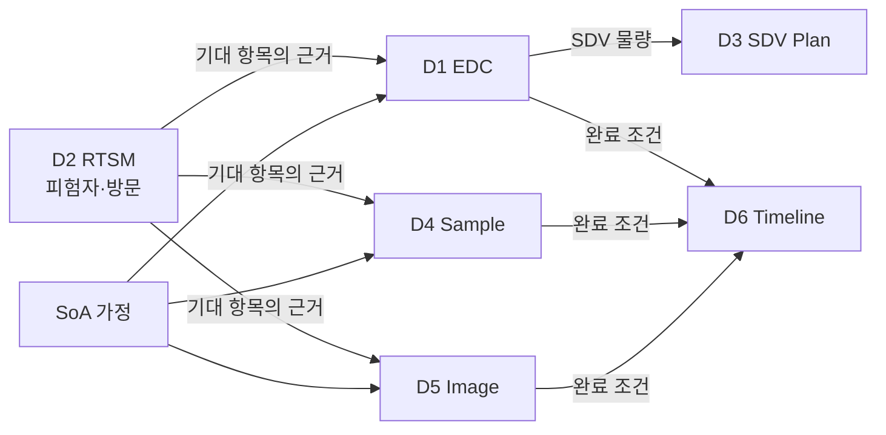

# 04. 도메인별 개념 정의

이 문서는 요구사항의 여섯 도메인을 [03](03-core-concept-model.md)의 네 아키타입에 매핑하고, 각 도메인 고유의 규칙을 정의합니다.

각 도메인 절은 동일한 형식을 따릅니다. **아키타입 매핑 → 고유 개념 → 지표 정의 → 화면 개념 → 검토 포인트**.

---

## 1. D1 — EDC Data Performance

### 1.1 아키타입 매핑

| 요구사항 | 아키타입 | 비고 |
|---|---|---|
| a~b, d~h (7개 진척 지표) | **A1** Expectation Item (Form) | 하나의 폼이 7개 단계를 통과 |
| c (쿼리) | **A2** Issue Object | query group 축 포함 |

### 1.2 단계 체인

```
expected → entered → SDV'd → reviewed → coded → signed → frozen → locked
```

각 단계의 범위 규칙(Stage Scope Rule)은 다음과 같이 다릅니다.

| 단계 | 범위 규칙 | 전형적 범위 |
|---|---|---|
| entry | 전체 폼 | 100% |
| SDV | risk-based SDV 계획 | 핵심 폼 또는 표본 % |
| data review | DMP의 리뷰 대상 정의 | 대부분 또는 전체 |
| medical coding | 코딩 대상 폼 (AE, CM, MH 등) | 특정 폼만 |
| investigator sign | 서명 대상 폼 집합 | 정의된 집합 |
| freezing | freeze 대상 | 보통 전체 |
| locking | lock 대상 | 보통 전체 |

> 요구사항 h의 "expected locked forms, locking backlog, **freezing rate**"는 문맥상 **locking rate**의 오기로 보아 그렇게 정의했습니다.

### 1.3 고유 개념 — 폼 인스턴스의 정체

폼 인스턴스를 무엇으로 셀지가 정확히 정의되어야 합니다. 다음 세 가지 경우가 실무에서 문제를 일으킵니다.

| 상황 | 처리 |
|---|---|
| **반복 폼(log-type form)** — AE, CM처럼 건수가 가변 | 기대 개수를 미리 알 수 없으므로 **entry 단계의 분모에서 제외**하고, 입력된 건수에 대해서만 이후 단계(SDV, coding 등)를 추적 |
| **미방문·중도탈락 피험자의 폼** | 방문이 발생하지 않았으므로 due가 되지 않음. 탈락 시점 이후 방문은 `NOT_APPLICABLE` 처리 |
| **비예정 방문(unscheduled visit)** | SoA로 예측 불가. 발생 후 실적 기반으로 기대 항목 생성 |

이 세 가지는 개념적으로 하나의 원칙으로 정리됩니다.

> **원칙.** 기대 개수를 프로토콜로 알 수 있는 것은 **예측**하고, 알 수 없는 것은 **실적 발생 후 기대 항목을 생성**한다.

### 1.4 지표 정의

[03](03-core-concept-model.md) 3.5의 공식이 7개 단계에 그대로 적용됩니다. 쿼리는 다음과 같습니다.

| 지표 | 정의 |
|---|---|
| total queries | 기간 내 발행된 전체 쿼리 수 |
| open queries | 현재 `OPEN` 상태 |
| answered queries | 현재 `ANSWERED` 상태 (사이트가 답했으나 미종결) |
| closed queries | 현재 `CLOSED` 상태 |
| query aging | `OPEN` 쿼리의 경과일 분포 (0-7 / 8-14 / 15-30 / 30+ 구간) |
| query group별 분해 | 요구사항 D1-c. 쿼리 유형·발행 주체·심각도 축으로 위 지표를 각각 산출 |

### 1.5 화면 개념

시험 레벨에서 **7단계 진척 막대(stage funnel)** 를 하나의 시각 요소로 보여주는 것을 제안합니다. 각 단계의 막대 길이가 완료율이고, 단계 간 격차가 곧 병목입니다. 이 하나의 그림으로 "지금 어디가 막혔는가"를 즉시 알 수 있습니다.

```
entry    ████████████████████░░  91%
SDV      ████████████░░░░░░░░░░  58%   ← 병목
review   ███████████████░░░░░░░  72%
coding   ██████████████████░░░░  84%
sign     ████████░░░░░░░░░░░░░░  41%
freeze   ███░░░░░░░░░░░░░░░░░░░  15%
lock     ░░░░░░░░░░░░░░░░░░░░░░   0%
```

### 1.6 검토 포인트

| # | 사항 | 제안 |
|---|---|---|
| DP-04-1 | 1.3의 반복 폼 처리 방식이 타당한가 | 제안대로 |
| DP-04-2 | query group의 축을 무엇으로 할 것인가 (유형/발행자/심각도/기능팀) | 4축 모두 지원, 설정 가능 |
| DP-04-3 | 폼 단위 대신 항목(item/field) 단위 추적이 필요한가 | **폼 단위로 시작**, 필요 시 확장 |

---

## 2. D2 — RTSM Trial Status

### 2.1 아키타입 매핑

| 요구사항 | 아키타입 | 비고 |
|---|---|---|
| a. 피험자 상태 | 마스터 데이터 | Expectation Engine의 **입력**이기도 함 |
| b. 층화 | 마스터 데이터 (눈가림 대상 가능) | |
| c. 예정 방문 목록 | **A1** Expectation Item (Visit) | |
| d. 실제 방문 + 윈도우 이탈 | **A1**의 실적 + 파생 지표 | |

### 2.2 D2의 특별한 위치

D2는 다른 도메인과 성격이 다릅니다. **D2는 다른 모든 도메인의 연료**입니다.

```
RTSM 피험자 등록 → 방문 스케줄 전개 → SoA 적용 → EDC 폼·샘플·이미지 기대 항목 생성
                                                    (D1)   (D4)    (D5)
```

따라서 구현 순서에서 D2는 **D1보다 먼저 또는 동시에** 필요합니다 (→ [10](10-mvp-and-roadmap.md)).

### 2.3 고유 개념 — 방문 윈도우와 이탈

방문 윈도우는 기준일(보통 randomization date 또는 first dose date)로부터 계산됩니다.

```
target_date   = anchor_date + offset_days
window_start  = target_date - window_before
window_end    = target_date + window_after
```

실제 방문이 발생하면 이탈을 계산합니다.

| 상황 | 계산 | 표시 |
|---|---|---|
| `actual < window_start` | `window_start - actual` | **조기(under)** N일 |
| `window_start ≤ actual ≤ window_end` | 0 | 준수(in window) |
| `actual > window_end` | `actual - window_end` | **지연(over)** N일 |
| 미발생 & `today > window_end` | `today - window_end` | **미수행(missed)** N일 경과 |

마지막 행이 중요합니다. 요구사항에는 "실제 방문의 이탈"만 있지만, **아직 일어나지 않은 채 윈도우를 넘긴 방문**이야말로 조기 경보 가치가 가장 큽니다. 이를 별도 상태로 추가할 것을 제안합니다.

### 2.4 고유 개념 — 피험자 상태 모델

피험자 상태는 시험마다 다르므로 **설정 가능한 상태 집합**으로 둡니다. 다만 다음 표준 상태를 기본 제공합니다.

```
screened → screen failed
         → enrolled → randomized → on treatment → follow-up → completed
                                                            → discontinued
                                                            → withdrawn
                                                            → lost to follow-up
                                                            → death
```

각 상태는 **기대 항목 생성에 영향**을 줍니다. 예를 들어 `discontinued` 이후의 방문은 대부분 `NOT_APPLICABLE`이 되지만, 시험에 따라 follow-up 방문은 계속 기대될 수 있습니다. 이 규칙도 가정(Assumption Set)의 일부입니다.

### 2.5 눈가림 고려

층화 정보(D2-b)와 배정군은 눈가림 대상일 수 있습니다. 필드 수준 마스킹 규칙을 적용합니다 (→ [08](08-platform-services.md) 2.4).

### 2.6 검토 포인트

| # | 사항 | 제안 |
|---|---|---|
| DP-04-4 | 2.3의 `missed` 상태를 추가할 것인가 | **추가** |
| DP-04-5 | 방문 윈도우 기준일(anchor)이 시험마다 다른가 | 시험별 설정 |
| DP-04-6 | 층화 정보를 기본 눈가림 대상으로 볼 것인가 | 기본 마스킹, 권한으로 해제 |

---

## 3. D3 — SDV Plan Management

### 3.1 아키타입 매핑

| 요구사항 | 아키타입 |
|---|---|
| a~c. SDV 방문 일자와 상태 | **A3** Resource Plan |
| d. CRA 리소스 | **A3**의 용량 속성 |
| e. 계획 적정성 평가 | **A3**의 평가 로직 (D1의 SDV 단계와 결합) |

### 3.2 고유 개념 — 계획과 실적의 이중 상태

요구사항 D3-b가 "계획 단계라면 확정/잠정, 아니면 완료/취소"라고 표현한 것을 상태 기계로 정리하면 다음과 같습니다.

```
TENTATIVE ──confirm──> ARRANGED ──execute──> COMPLETED
    │                      │
    └──────cancel──────────┴──────────────> CANCELLED
```

| 상태 | 의미 | 일자 필드 |
|---|---|---|
| `TENTATIVE` | 잠정 계획 | planned_date |
| `ARRANGED` | 사이트와 확정 | planned_date |
| `COMPLETED` | 방문 수행 완료 | planned_date + actual_date |
| `CANCELLED` | 취소 | planned_date + 취소 사유 |

요구사항 D3-c의 "완료된 SDV 방문 일자들"은 `COMPLETED` 상태의 `actual_date` 목록으로 자연히 표현됩니다.

### 3.3 고유 개념 — 계획 적정성 평가 (요구사항 D3-e)

이 앱에서 **가장 가치가 높은 기능**이자 가장 설계가 어려운 기능입니다. 개념은 다음과 같습니다.

```
① 예측:  방문 시점 T까지 이 사이트에서 발생할 SDV 대상 물량을 예측
          = 현재 SDV backlog + (T까지 예상 신규 SDV 대상)

② 용량:  계획된 방문이 처리 가능한 물량을 계산
          = Σ (방문일수 × CRA 인원 × 일일 처리량)

③ 평가:  용량 / 예측물량 의 비율로 판정
```

| 비율 | 판정 | 화면 표시 |
|---|---|---|
| < 0.8 | **부족(under)** | 빨강 — 방문 추가 필요 |
| 0.8 ~ 1.2 | **적정(adequate)** | 초록 |
| > 1.2 | **과다(over)** | 노랑 — 리소스 재배치 검토 |

`일일 처리량`은 초기에는 설정값(예: CRA 1인당 하루 40폼)으로 두고, 데이터가 쌓이면 실제 완료 이력에서 학습한 값으로 대체합니다.

> **설계 주의.** 이 기능은 "틀린 예측을 자신 있게 보여주는" 위험이 있습니다. 판정 옆에 **예측의 근거와 불확실성**(예: "최근 8주 등록 속도 기준, 신규 사이트 2곳 제외")을 항상 함께 표시해야 합니다.

### 3.4 검토 포인트

| # | 사항 | 제안 |
|---|---|---|
| DP-04-7 | 3.3의 임계값 0.8 / 1.2가 타당한가 | 설정 가능, 기본값으로 채택 |
| DP-04-8 | 일일 처리량을 무엇으로 측정할 것인가 (폼 수, 항목 수, 피험자 수) | **폼 수** 기본, 설정 가능 |
| DP-04-9 | SDV 방문 외 다른 모니터링 방문 유형(초기 방문, 종료 방문)도 관리할 것인가 | **포함** (방문 유형 속성 추가) |

---

## 4. D4 — Sample Progress Management

### 4.1 아키타입 매핑

| 요구사항 | 아키타입 |
|---|---|
| a~d, g. 예상·채취·배송·도착·분석 | **A1** Expectation Item (Sample), 단계 체인 |
| e. 대조 상태 | **Reconciliation** 결과의 요약 |
| f. 알려진 이슈 | **A2** Issue Object (차단 가능) |

### 4.2 단계 체인 — 두 개의 물류 구간

```
expected → collected → shipped(site) → received(central lab)
                                     → shipped(central) → received(bioanalytics lab)
                                     → assigned → analyzed
```

요구사항 c와 d가 각각 central lab 구간과 bioanalytics lab 구간을 나눈 것이 이 체인에 반영되어 있습니다. 각 구간에서 **분실(lost)** 이 발생할 수 있으며, 분실은 단계 상태가 아니라 **차단 이슈**로 모델링합니다. 분실 샘플은 영원히 다음 단계로 가지 못하므로 backlog에서 분리되어야 하기 때문입니다.

### 4.3 고유 개념 — 샘플 식별 체계

샘플 추적의 실무적 어려움은 대부분 **식별자 불일치**에서 옵니다. 세 가지 식별자가 서로 다른 시스템에 존재합니다.

| 식별자 | 소유 시스템 | 문제 |
|---|---|---|
| kit / barcode ID | 사이트·RTSM | 사이트가 잘못 붙이거나 누락 |
| accession number | central lab | lab이 부여, 사이트는 모름 |
| EDC 채취 기록 | EDC | 별도 식별자 없이 (subject, visit, sample type)로만 존재 |

따라서 매칭은 **다단계 폴백**으로 설계합니다.

```
1차: barcode / kit ID 로 매칭
2차: accession number 로 매칭 (lab 리포트 간)
3차: (subject, visit, sample type, sequence) 조합으로 매칭
실패: Ambiguous / Unmatched 로 분류하여 reconciliation 목록에 노출
```

### 4.4 고유 개념 — 샘플 이슈의 업무 연결 (요구사항 D4-f)

"용혈처럼 데이터 대조나 샘플 분석 업무로 연결되어야 하는 이슈"를 표현하기 위해 이슈에 **후속 업무 연결(referral)** 속성을 둡니다.

| 속성 | 값 예시 |
|---|---|
| issue type | hemolysis, insufficient volume, temperature excursion, broken container, lost in transit, label mismatch |
| referral to | data reconciliation / sample analysis / site query / protocol deviation |
| blocking | true (분석 불가) / false (기록만) |
| resolution | resampled / waived / data excluded / resolved |

### 4.5 분석 상태 (요구사항 D4-g)

```
assigned → analyzed
        → rejected (사유 필수, 차단 이슈로 연결)
```

### 4.6 검토 포인트

| # | 사항 | 제안 |
|---|---|---|
| DP-04-10 | 샘플 단위가 무엇인가 — 채혈 1회(draw)인가 분주 1개(aliquot)인가 | **aliquot 단위** 추적, draw로 그룹핑 |
| DP-04-11 | 4.4의 issue type 목록이 충분한가 | 설정 가능 목록으로, 표는 초기값 |
| DP-04-12 | central lab과 bioanalytics lab이 시험마다 다수일 수 있는가 | **다수 허용** (lab을 엔티티로) |

---

## 5. D5 — Image Progress Management

### 5.1 아키타입 매핑

| 요구사항 | 아키타입 |
|---|---|
| a~c, g. 예상·획득·업로드·판독 | **A1** Expectation Item (Image), 단계 체인 |
| d. 대조 상태 | **Reconciliation** 결과의 요약 |
| f. 알려진 이슈 | **A2** Issue Object |

### 5.2 단계 체인

```
expected → acquired → uploaded(BICR) → QC passed → assigned → read
```

벤치마크 조사([01](01-benchmark.md) 1.4)에서 확인한 업계의 표준 질문("이번 주에 어떤 영상이 예상되었고, 어떤 것이 도착했고, 어떤 것이 QC에 실패했고, 어떤 것이 기한을 넘겼는가")이 이 체인으로 그대로 답변됩니다.

### 5.3 고유 개념 — QC 실패의 처리

QC 실패는 단순한 미완료가 아니라 **재획득 요구**로 이어집니다.

```
uploaded → QC failed → (재획득 요청) → re-acquired → re-uploaded → QC passed
```

QC 실패 건은 **별도 지표**로 관리합니다. QC 실패율은 사이트의 영상 품질을 나타내는 유용한 KRI입니다.

### 5.4 고유 개념 — 판독 구조

요구사항 D5-g의 "assigned / QCed / read"를 실제 BICR 구조로 확장하면 다음과 같습니다.

| 개념 | 설명 |
|---|---|
| reader assignment | 눈가림 판독자 배정 (보통 2인) |
| double read | 독립 2인 판독 |
| adjudication | 두 판독이 불일치할 때 제3 판독자의 조정 |

초기 범위에서는 **판독 완료 여부**만 추적하고, double read와 adjudication은 **개념에는 포함하되 구현은 후속 단계**로 두는 것을 제안합니다. 시험 설계에 따라 필요 없을 수도 있기 때문입니다.

### 5.5 고유 개념 — INV vs BICR 대조 (요구사항 D5-d)

벤치마크에서 확인한 바에 따르면 BICR 데이터와 investigator 평가 데이터 간 **피험자 집합, 스캔 집합, 방문, 날짜, 평가 방법의 일관성 확인**이 표준 업무입니다. 이것을 [03](03-core-concept-model.md) 5장의 reconciliation 4유형에 매핑하면 다음과 같습니다.

| 대조 항목 | 불일치 유형 |
|---|---|
| EDC에 영상 평가 기록 있으나 BICR에 영상 없음 | Expected but not received |
| BICR에 영상 있으나 EDC에 방문 기록 없음 | Received but not expected |
| 영상 획득일이 EDC와 BICR에서 상이 | Matched but discrepant |
| 평가 방법(CT/MRI) 불일치 | Matched but discrepant |

### 5.6 검토 포인트

| # | 사항 | 제안 |
|---|---|---|
| DP-04-13 | double read와 adjudication을 초기 범위에 넣을 것인가 | **개념만 포함, 구현은 Phase 2** |
| DP-04-14 | 영상 단위가 무엇인가 — 검사 1건(study)인가 시리즈인가 | **검사(study) 단위** |
| DP-04-15 | 5.3의 QC 실패율을 KRI로 승격할 것인가 | **승격** |

---

## 6. D6 — Project Timeline Management

### 6.1 아키타입 매핑

| 요구사항 | 아키타입 |
|---|---|
| a. 마일스톤 | **A4** Timeline Plan (상위) |
| b. 상세 task | **A4** Timeline Plan (하위) |

### 6.2 두 계층 구조

요구사항이 마일스톤과 상세 타임라인을 나눈 것은 **보는 사람이 다르기** 때문입니다.

| 계층 | 속성 | 주 사용자 |
|---|---|---|
| Milestone | 이름, 유형, 계획일, 실제일, 상태, 지연/조기 일수 | P7 경영층, P6 PM |
| Task | 카테고리, 서브카테고리, 이름, 회차(round), 시작일, 종료일, 관련 기능팀, 완료 조건 | P6 PM, 각 기능팀 |

### 6.3 고유 개념 — Task Round (요구사항 D6-b)

"task round"는 같은 task가 여러 번 반복되는 것을 표현합니다. dry run 1차·2차, interim DBL 1차·2차 등이 여기 해당합니다. 개념적으로는 **task template과 task instance의 분리**입니다.

```
Task Template (예: "Dry Run")
  ├── Instance round 1  (2026-03-01 ~ 2026-03-15)
  ├── Instance round 2  (2026-06-01 ~ 2026-06-15)
  └── Instance round 3  (2026-09-01 ~ 2026-09-15)
```

### 6.4 고유 개념 — 완료 조건 (요구사항 D6-b)

"completion conditions required"를 단순 텍스트로 두면 활용도가 낮습니다. 이 앱의 강점을 살리려면 **다른 도메인의 지표를 완료 조건으로 연결**할 수 있어야 합니다.

| 조건 유형 | 예시 | 자동 판정 |
|---|---|---|
| 수동 | "DM lead 승인" | 사람이 체크 |
| **지표 기반** | "entry rate ≥ 99% AND open queries = 0" | **앱이 자동 판정** |
| 선행 task | "Task A 완료 후" | 자동 판정 |

지표 기반 완료 조건이 이 앱에서만 가능한 기능입니다. UC-4(DBL 준비도 판단)가 바로 이 기능 위에서 작동합니다.

### 6.5 지표

```
variance(days) = actual_date - planned_date        # 음수는 조기, 양수는 지연
status         = PLANNED | IN_PROGRESS | COMPLETED | AT_RISK | MISSED
```

`AT_RISK`는 아직 기한 전이지만 **예측상 달성 어려움**으로 판정된 상태입니다. 이것이 요구사항에는 없지만 추가를 제안하는 항목입니다. 이미 놓친 마일스톤을 보여주는 것보다 놓칠 마일스톤을 미리 보여주는 것이 훨씬 가치 있기 때문입니다.

### 6.6 검토 포인트

| # | 사항 | 제안 |
|---|---|---|
| DP-04-16 | 6.5의 `AT_RISK` 상태를 추가할 것인가 | **추가** |
| DP-04-17 | 6.4의 지표 기반 완료 조건을 초기 범위에 넣을 것인가 | Phase 2 (개념은 지금 확정) |
| DP-04-18 | 마일스톤 유형 목록을 고정할 것인가 | 설정 가능 목록 |
| DP-04-19 | Gantt 형태 시각화가 필요한가 | 필요, 단 Phase 2 |

---

## 7. 도메인 간 의존 관계 요약



이 그림이 개발 순서를 결정합니다. **D2가 모든 것의 뿌리**이고, D3와 D6은 다른 도메인의 산출을 소비합니다 (→ [10](10-mvp-and-roadmap.md)).
