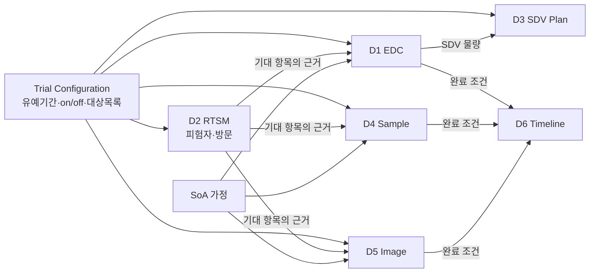

# 04. 도메인별 개념 정의

이 문서는 요구사항의 여섯 도메인을 [03](03-core-concept-model.md)의 네 아키타입에 매핑하고, 각 도메인 고유의 규칙을 정의합니다.

*개정 이력: v2 (검토 반영 — EDC 병행 단계, 유예 기간 재정의, investigator sign 특수 처리, data review on/off, 샘플 Reconciliation 재정의, image 단계 세분화, 쿼리 기한 도입)*

각 도메인 절은 동일한 형식을 따릅니다. **아키타입 매핑 → 고유 개념 → 지표 정의 → 화면 개념 → 검토 포인트**.

---

## 1. D1 — EDC Data Performance

### 1.1 아키타입 매핑

| 요구사항 | 아키타입 | 비고 |
|---|---|---|
| a~b, d~h (7개 진척 지표) | **A1** Expectation Item (Form) | 하나의 폼이 단계 그래프를 통과 |
| c (쿼리) | **A2** Issue Object | 소유자별 기한과 query group 축 포함 |

### 1.2 단계 그래프 (검토 반영)

초안의 7단계 선형 체인을 **입력 후 5단계 병행 구조**로 수정했습니다.

```
expected → entered ──┬──> SDV'd   ──┐
                     ├──> reviewed ─┤
                     ├──> coded   ──┼──> locked
                     ├──> frozen  ──┤
                     └──> signed  ──┘
```

`entered` 이후의 다섯 단계는 서로 선후 관계가 없습니다. 각각 독립적인 분모, 독립적인 유예 기간, 독립적인 완료 판정을 가집니다. `locked`만 전 단계 완료를 전제로 합니다.

이 구조 변경이 갖는 의미는 화면에서 드러납니다. 초안의 "단계 막대"는 위에서 아래로 줄어드는 깔때기였으나, 실제로는 **다섯 갈래가 병렬로 진행**되므로 서로의 진척이 독립적으로 비교됩니다. 어느 갈래가 뒤처지는지가 곧 병목입니다.

### 1.3 단계별 범위와 유예 기간

| 단계 | Due 트리거 | 기본 유예 기간 | 범위 규칙 | 시험별 설정 |
|---|---|---|---|---|
| entry | 방문 발생일 | **+14 달력일** | 전체 폼 | 기간 |
| SDV | 폼 입력 완료 | **+60 달력일** | **partial SDV 설정** | 기간, 대상 범위 |
| data review | 폼 입력 완료 | **+30 달력일** | DMP 리뷰 대상 | 기간, **적용 여부 on/off** |
| medical coding | 해당 폼 입력 완료 | **+60 달력일** | 코딩 대상 폼 (AE, CM, MH 등) | 기간, 대상 폼 |
| investigator sign | — | **없음 (특수 처리)** | 서명 대상 폼 집합 | 대상 폼, SAE 판정 기준 |
| freezing | 서명 완료 | DBL 계획 기준 | freeze 대상 | 기간 |
| locking | 전 단계 완료 | DBL 계획 기준 | lock 대상 | 기간 |

모든 값은 [13](13-trial-configuration.md)의 설정 template으로 시험마다 지정합니다.

> 요구사항 h의 "expected locked forms, locking backlog, **freezing rate**"는 문맥상 **locking rate**의 오기로 보아 그렇게 정의했습니다.

### 1.4 data review의 적용 여부 (검토 반영)

Data review flagging을 운영하지 않는 시험이 있습니다. 이 경우 지표를 0%로 표시하면 "리뷰가 전혀 안 되고 있다"는 오해를 부릅니다.

```
trial_config.stages.data_review.enabled = false
  → 화면에서 해당 단계 숨김
  → 집계에서 제외
  → export 컬럼에서 제외 (또는 null, 0이 아님)
  → 설정 화면에 "이 시험은 data review를 적용하지 않음"으로 표시
```

같은 원칙을 다른 선택적 단계에도 적용합니다. **지표를 끄는 것과 지표가 0인 것은 완전히 다릅니다.**

### 1.5 investigator sign의 특수 처리 (검토 반영)

서명 여부는 audit trail 이력을 통해서만 정확히 파악됩니다. 서명 시점을 신뢰성 있게 특정하기 어려우므로 유예 기간 개념을 적용하기가 현실적으로 어렵습니다.

따라서 이 단계만 다르게 다룹니다.

| 항목 | 처리 |
|---|---|
| 유예 기간 | 적용하지 않음 |
| `OVERDUE` 상태 | 사용하지 않음 |
| 집계 | **미서명 건수(sign pending)만** 산출 |
| 구분 | **전체 데이터 / SAE 데이터** 두 축으로 각각 집계 |

```
sign_pending_all = count(서명 대상 폼 중 미서명, 전체)
sign_pending_sae = count(서명 대상 폼 중 미서명, SAE 해당)
```

SAE를 별도로 뽑는 이유는 명확합니다. SAE 관련 데이터의 서명 지연은 안전성 보고와 직결되므로 다른 데이터와 같은 줄에 두고 볼 수 없습니다.

SAE 해당 여부의 판정 기준(폼 종류인지, 별도 플래그인지, AE 심각도 값인지)은 표준 template의 명시 필드로 받습니다 (DP-03-12).

### 1.6 쿼리 지표 (검토 반영)

초안에서 쿼리는 기한 없이 경과일만 추적했으나, **기한 개념을 도입**했습니다.

| 지표 | 정의 |
|---|---|
| total queries | 기간 내 발행된 전체 쿼리 수 |
| open queries | 현재 `OPEN` 상태 |
| answered queries | 현재 `ANSWERED` 상태 |
| closed queries | 현재 `CLOSED` 상태 |
| **overdue open** | `OPEN` 이면서 기한 초과 |
| **overdue answered** | `ANSWERED` 이면서 기한 초과 |
| query aging | 경과일 분포 (0-7 / 8-14 / 15-30 / 30+) |

#### 기한 규칙

| 대상 | Due 트리거 | 기본 유예 기간 |
|---|---|---|
| open query | 쿼리 생성일 | **+14 달력일** |
| answered query | 쿼리 생성일 | **+30 달력일** |

#### 소유자별 차등 (검토 반영)

응답 책임 기능팀마다 기대 응답 시간이 다르므로 소유자별로 기한을 따로 설정합니다.

| Query owner | 기본 유예 기간 | 근거 |
|---|---|---|
| PV | **+7 달력일** | 안전성 관련, 가장 짧음 |
| DM | **+14 달력일** | 일상 데이터 확인 |
| MM | **+30 달력일** | 의학적 검토 소요 |
| CRA | **+60 달력일** | 사이트 방문 주기와 연동 |

소유자 목록과 각 기간은 시험별 설정 항목입니다 ([13](13-trial-configuration.md)). 설정되지 않은 소유자는 위 open/answered 기본값을 따릅니다.

모든 쿼리 지표는 **소유자별·query group별로 분해**됩니다 (요구사항 D1-c).

### 1.7 고유 개념 — 폼 인스턴스의 정체

폼 인스턴스를 무엇으로 셀지가 정확히 정의되어야 합니다.

| 상황 | 처리 |
|---|---|
| **반복 폼(log-type form)** — AE, CM처럼 건수가 가변 | 기대 개수를 미리 알 수 없으므로 **entry 단계의 분모에서 제외**하고, 입력된 건수에 대해서만 이후 단계를 추적 |
| **미방문·중도탈락 피험자의 폼** | 방문 미발생이므로 due가 되지 않음. 탈락 이후 방문은 `NOT_APPLICABLE` |
| **비예정 방문(unscheduled visit)** | SoA로 예측 불가. 발생 후 실적 기반으로 기대 항목 생성 |

> **원칙.** 기대 개수를 프로토콜로 알 수 있는 것은 **예측**하고, 알 수 없는 것은 **실적 발생 후 기대 항목을 생성**한다.

### 1.8 화면 개념

병행 구조를 반영해 **입력을 뿌리로 하고 다섯 갈래가 갈라지는 형태**로 표시합니다.

```
  entered  ████████████████████░░  91%   (due 12,400 / done 11,284)
     ├─ SDV'd    ████████████░░░░░░  58%  ← 뒤처짐
     ├─ reviewed ███████████████░░░  72%
     ├─ coded    ██████████████████  84%
     ├─ frozen   ███░░░░░░░░░░░░░░░  15%
     └─ signed   ▸ pending 3,204건 (SAE 12건)   ← 기한 개념 없음
  locked   ░░░░░░░░░░░░░░░░░░░░░░   0%

  예외(WAIVED) 84건 · 분모 제외됨  [상세]
```

`signed`가 다른 막대와 다르게 표시되는 것이 1.5의 특수 처리를 반영한 것입니다.

### 1.9 검토 포인트

| # | 사항 | 제안 |
|---|---|---|
| DP-04-1 | 1.7의 반복 폼 처리 방식이 타당한가 | 제안대로 |
| DP-04-2 | query group의 축을 무엇으로 할 것인가 | 소유자·유형·심각도·기능팀 4축, 설정 가능 |
| DP-04-3 | 폼 단위 대신 항목(item/field) 단위 추적이 필요한가 | **폼 단위로 시작** |
| DP-04-20 | 1.3의 freezing/locking 기준을 DBL 계획일 외에 둘 것인가 | DBL 계획 기준 유지 |

---

## 2. D2 — RTSM Trial Status

### 2.1 아키타입 매핑

| 요구사항 | 아키타입 | 비고 |
|---|---|---|
| a. 피험자 상태 | 마스터 데이터 | Expectation Engine의 **입력**이기도 함 |
| b. 층화 | 마스터 데이터 (눈가림 대상 가능) | |
| c. 예정 방문 목록 | **A1** Expectation Item (Visit) | |
| d. 실제 방문 + 윈도우 이탈 | **A1**의 실적 + 파생 지표 | |

### 2.2 D2의 특별한 위치

**D2는 다른 모든 도메인의 연료**입니다.

```
RTSM 피험자 등록 → 방문 스케줄 전개 → SoA 적용 → EDC 폼·샘플·이미지 기대 항목 생성
                                                    (D1)   (D4)    (D5)
```

따라서 구현 순서에서 D2는 D1보다 먼저 또는 동시에 필요합니다 ([10](10-mvp-and-roadmap.md)).

### 2.3 방문 윈도우와 이탈

```
target_date   = anchor_date + offset_days
window_start  = target_date - window_before
window_end    = target_date + window_after
```

| 상황 | 계산 | 표시 |
|---|---|---|
| `actual < window_start` | `window_start - actual` | **조기(under)** N일 |
| `window_start ≤ actual ≤ window_end` | 0 | 준수(in window) |
| `actual > window_end` | `actual - window_end` | **지연(over)** N일 |
| 미발생 & `today > window_end` | `today - window_end` | **미수행(missed)** N일 경과 |

마지막 행은 요구사항에 없지만 추가를 제안하는 항목입니다. 아직 일어나지 않은 채 윈도우를 넘긴 방문이야말로 조기 경보 가치가 가장 큽니다.

### 2.4 피험자 상태 모델

시험마다 다르므로 **설정 가능한 상태 집합**으로 두되, 다음을 기본 제공합니다.

```
screened → screen failed
         → enrolled → randomized → on treatment → follow-up → completed
                                                            → discontinued
                                                            → withdrawn
                                                            → lost to follow-up
                                                            → death
```

각 상태는 **기대 항목 생성에 영향**을 줍니다. `discontinued` 이후 방문의 처리 방식(전부 `NOT_APPLICABLE`인지, follow-up은 계속 기대되는지)은 시험별 설정 항목입니다.

### 2.5 눈가림 고려

층화 정보(D2-b)와 배정군은 눈가림 대상일 수 있습니다. 필드 수준 마스킹 규칙을 적용합니다 ([08](08-platform-services.md) 2.4).

### 2.6 검토 포인트

| # | 사항 | 제안 |
|---|---|---|
| DP-04-4 | 2.3의 `missed` 상태를 추가할 것인가 | **추가** |
| DP-04-5 | 방문 윈도우 기준일(anchor)이 시험마다 다른가 | 시험별 설정 |
| DP-04-6 | 층화 정보를 기본 눈가림 대상으로 볼 것인가 | 기본 마스킹, 권한으로 해제 |

---

## 3. D3 — SDV Plan Management

### 3.1 아키타입 매핑

| 요구사항 | 아키타입 |
|---|---|
| a~c. SDV 방문 일자와 상태 | **A3** Resource Plan |
| d. CRA 리소스 | **A3**의 용량 속성 |
| e. 계획 적정성 평가 | **A3**의 평가 로직 (D1의 SDV 단계와 결합) |

### 3.2 계획과 실적의 상태 기계

```
TENTATIVE ──confirm──> ARRANGED ──execute──> COMPLETED
    │                      │
    └──────cancel──────────┴──────────────> CANCELLED
```

| 상태 | 의미 | 일자 필드 |
|---|---|---|
| `TENTATIVE` | 잠정 계획 | planned_date |
| `ARRANGED` | 사이트와 확정 | planned_date |
| `COMPLETED` | 방문 수행 완료 | planned_date + actual_date |
| `CANCELLED` | 취소 | planned_date + 취소 사유 |

요구사항 D3-c의 "완료된 SDV 방문 일자들"은 `COMPLETED` 상태의 `actual_date` 목록입니다.

### 3.3 계획 적정성 평가 (요구사항 D3-e)

```
① 예측:  방문 시점 T까지 이 사이트에서 발생할 SDV 대상 물량
          = 현재 SDV backlog + (T까지 예상 신규 SDV 대상)
          ※ partial SDV 설정이 적용된 분모 기준

② 용량:  Σ (방문일수 × CRA 인원 × 일일 처리량)

③ 평가:  용량 / 예측물량
```

| 비율 | 판정 | 표시 |
|---|---|---|
| < 0.8 | **부족(under)** | 빨강 — 방문 추가 필요 |
| 0.8 ~ 1.2 | **적정(adequate)** | 초록 |
| > 1.2 | **과다(over)** | 노랑 — 리소스 재배치 검토 |

예측은 [03](03-core-concept-model.md) 3.4의 **Forecast-expected** 기준을 사용합니다. 화면의 기준 토글과 연동되어, 사용자가 Forecast 기준으로 전환하면 이 판정의 근거 물량이 그대로 표시됩니다.

> **설계 주의.** 판정 옆에 **예측의 근거와 불확실성**을 항상 함께 표시해야 합니다. 예: "최근 8주 등록 속도 기준, 신규 사이트 2곳 제외, SDV 유예 60일 설정 반영".

### 3.4 검토 포인트

| # | 사항 | 제안 |
|---|---|---|
| DP-04-7 | 3.3의 임계값 0.8 / 1.2가 타당한가 | 설정 가능, 기본값으로 채택 |
| DP-04-8 | 일일 처리량의 측정 단위 | **폼 수** 기본, 설정 가능 |
| DP-04-9 | SDV 외 다른 모니터링 방문 유형도 관리할 것인가 | **포함** (방문 유형 속성) |

---

## 4. D4 — Sample Progress Management

### 4.1 아키타입 매핑

| 요구사항 | 아키타입 |
|---|---|
| a~d, g | **A1** Expectation Item (Sample), 단계 체인 |
| e. 대조 상태 | **Reconciliation** 결과의 요약 |
| f. 알려진 이슈 | **A2** Issue Object (해결 불가 시 `WAIVED` 전이) |

### 4.2 단계 체인과 유예 기간 (검토 반영)

```
expected → collected → received(central lab) → received(bioanalytics lab) → assigned → analyzed
```

| 단계 | Due 트리거 | 기본 유예 기간 | 비고 |
|---|---|---|---|
| collected | 방문 발생일 | **+0 달력일** | |
| received (central lab) | **채취일** | **+30 달력일** | **사이트 출고일을 알 수 없는 경우가 많아 채취일을 기준으로 함** |
| received (bioanalytics lab) | central lab 도착일 | 설정값 (DP-03-8) | |
| assigned | bioanalytics 도착일 | 설정값 | 분석 배정 |
| analyzed | 분석 배정일 | 설정값 (DP-03-8) | |

초안은 사이트 출고일을 트리거로 삼았으나, 실무에서 그 날짜를 확보할 수 없는 경우가 다수라는 검토 의견을 반영했습니다. 출고일은 **알면 기록하되 기한 계산에는 쓰지 않습니다.** 알 수 없는 값에 의존하는 지표는 계산이 안 되거나 조용히 틀립니다.

**분실(lost)** 은 단계 상태가 아니라 이슈로 모델링하고, 해결 불가 판정 시 `WAIVED (ISSUE_BLOCKED)`로 전이시켜 분모에서 제외합니다.

### 4.3 매칭 키와 식별 체계 (검토 반영)

샘플 추적의 실무적 어려움은 대부분 **식별자 불일치**와 **매칭 키 입도 부족**에서 옵니다.

#### 매칭 키 입도

```
권고 매칭 키:  kit_type(PK / ADA / NAB) + subject_id + visit  [+ aliquot 순번]
```

**kit 유형이 매칭 키에 포함되지 않으면 그 방문에 샘플이 있는 것으로 혼동됩니다.** PK만 도착하고 ADA가 오지 않았는데 "그 방문 샘플은 수령됨"으로 판정되는 것입니다. 이 입도 선언은 표준 template의 필수 메타데이터입니다 ([12](12-standard-source-templates.md)).

#### 식별자 폴백

| 식별자 | 소유 시스템 | 문제 |
|---|---|---|
| kit / barcode ID | 사이트·RTSM | 사이트가 잘못 붙이거나 누락 |
| accession number | central lab | lab이 부여, 사이트는 모름 |
| EDC 채취 기록 | EDC | (subject, visit, sample type)으로만 존재 |

```
1차: barcode / kit ID
2차: accession number (lab 리포트 간)
3차: (kit_type, subject_id, visit, sequence) 조합
실패: AMBIGUOUS_MATCH 로 분류하여 Reconciliation Center에 노출
```

### 4.4 Reconciliation 유형 (검토 반영)

입력은 사내 표준 파일(`DS05R`, external data reconciliation file 대응)이며, 앱은 그 파일의 EDC측·lab측 원시값으로 **자체 판정**합니다 ([03](03-core-concept-model.md) 5.1).

| 유형 | 정의 | 후속 조치 |
|---|---|---|
| **`EDC_Y_NOT_RECEIVED`** | EDC에서 collection = Y 이나 central lab 또는 bioanalytics lab에 없음 | 검체 추적 — 배송 중 분실 여부 확인 |
| **`RECEIVED_NOT_IN_EDC`** | lab에는 있으나 EDC에서 collection = N 이거나 값 없음 | EDC 데이터 정정 쿼리 |
| **`MATCHED_DISCREPANT`** | 매칭되나 샘플 정보 불일치 (채취일, kit 유형, 방문 등) | 정보 대조 |
| **`AMBIGUOUS_MATCH`** | 매칭 후보 다수 | 식별자 확인 |

앞의 두 유형은 방향이 반대인 동일한 대조이지만 **후속 조치가 완전히 다르므로** 합치지 않고 분리합니다.

각 건은 **어느 랩 구간에서 발생했는지**(central / bioanalytics)를 함께 기록하여 물류 구간별 문제를 드러냅니다.

표준 파일이 자체 대조 결과(`RECON_STATUS`)를 담고 있으면 앱의 판정과 비교하고, **불일치 건은 별도 목록으로 보고**합니다. 초기에는 불일치가 다수 나올 것으로 예상되며, 그 목록을 보며 양쪽 판정 기준을 맞춰가는 것이 Phase 1의 실질적 작업이 됩니다.

### 4.5 샘플 이슈의 업무 연결 (요구사항 D4-f)

| 속성 | 값 예시 |
|---|---|
| issue type | hemolysis, insufficient volume, temperature excursion, broken container, lost in transit, label mismatch |
| referral to | data reconciliation / sample analysis / site query / protocol deviation |
| unresolvable | true → 대상 항목을 `WAIVED (ISSUE_BLOCKED)`로 전이 |
| resolution | resampled / waived / data excluded / resolved |

### 4.6 분석 상태 (요구사항 D4-g)

```
assigned → analyzed
        → rejected (사유 필수 → 해결 불가 시 WAIVED 전이)
```

### 4.7 검토 포인트

| # | 사항 | 제안 |
|---|---|---|
| DP-04-10 | 샘플 단위 — 채혈 1회(draw)인가 분주 1개(aliquot)인가 | **aliquot 단위** 추적, draw로 그룹핑 |
| DP-04-11 | 4.5의 issue type 목록이 충분한가 | 설정 가능 목록, 표는 초기값 |
| DP-04-12 | central lab과 bioanalytics lab이 다수일 수 있는가 | **다수 허용** (lab을 엔티티로) |
| DP-04-21 | 4.3의 kit 유형 분류(PK/ADA/NAB) 외에 추가할 유형이 있는가 | 시험별 설정 목록 |

---

## 5. D5 — Image Progress Management

### 5.1 아키타입 매핑

| 요구사항 | 아키타입 |
|---|---|
| a~c, g | **A1** Expectation Item (Image), 단계 체인 |
| d. 대조 상태 | **Reconciliation** 결과의 요약 |
| f. 알려진 이슈 | **A2** Issue Object |

### 5.2 단계 체인과 유예 기간 (검토 반영)

```
expected → taken → uploaded(BICR) → QC passed → assigned → read
```

| 단계 | Due 트리거 | 기본 유예 기간 |
|---|---|---|
| **taken** | 획득 예정일 (방문 발생일) | **+0 달력일** |
| **uploaded (BICR)** | 획득일 | **+14 달력일** |
| QC passed | 업로드일 | 설정값 (DP-03-9) |
| assigned | QC 통과일 | 설정값 |
| read | 배정일 | 설정값 (DP-03-9) |

초안의 `acquired` 단계를 **`taken`으로 명확히 하고 유예 기간을 명시**했습니다. 영상 획득은 방문 당일 이루어지므로 유예가 없고, 업로드는 사이트의 처리 시간이 필요하므로 14일을 둡니다.

벤치마크([01](01-benchmark.md) 1.4)에서 확인한 업계의 표준 질문("이번 주에 어떤 영상이 예상되었고, 어떤 것이 도착했고, 어떤 것이 QC에 실패했고, 어떤 것이 기한을 넘겼는가")이 이 체인으로 그대로 답변됩니다.

### 5.3 QC 실패의 처리

```
uploaded → QC failed → (재획득 요청) → re-taken → re-uploaded → QC passed
```

QC 실패 건은 별도 지표로 관리합니다. QC 실패율은 사이트의 영상 품질을 나타내는 유용한 KRI입니다.

### 5.4 판독 구조

| 개념 | 설명 |
|---|---|
| reader assignment | 눈가림 판독자 배정 (보통 2인) |
| double read | 독립 2인 판독 |
| adjudication | 두 판독 불일치 시 제3 판독자 조정 |

초기 범위에서는 **판독 완료 여부**만 추적하고, double read와 adjudication은 개념에 포함하되 구현은 후속 단계로 둡니다.

### 5.5 INV vs BICR 대조 (요구사항 D5-d)

| 대조 항목 | 불일치 유형 |
|---|---|
| EDC에 영상 평가 기록 있으나 BICR에 영상 없음 | `EDC_Y_NOT_RECEIVED` 계열 |
| BICR에 영상 있으나 EDC에 해당 기록 없음 | `RECEIVED_NOT_IN_EDC` 계열 |
| 획득일이 EDC와 BICR에서 상이 | `MATCHED_DISCREPANT` |
| 검사 방법(CT/MRI) 불일치 | `MATCHED_DISCREPANT` |

매칭 키는 `subject_id + visit + modality`를 권고합니다. modality가 빠지면 샘플의 kit 유형과 같은 문제가 발생합니다.

입력은 결합형 표준 파일 `DS08R`이 기본이며, EDC측(`EDC_*`)과 BICR측(`BICR_*`) 값이 한 행에 들어옵니다 ([12](12-standard-source-templates.md) 4.9).

### 5.6 검토 포인트

| # | 사항 | 제안 |
|---|---|---|
| DP-04-13 | double read와 adjudication을 초기 범위에 넣을 것인가 | **개념만 포함, 구현은 Phase 2** |
| DP-04-14 | 영상 단위 — 검사 1건(study)인가 시리즈인가 | **검사(study) 단위** |
| DP-04-15 | 5.3의 QC 실패율을 KRI로 승격할 것인가 | **승격** |

---

## 6. D6 — Project Timeline Management

### 6.1 아키타입 매핑

| 요구사항 | 아키타입 |
|---|---|
| a. 마일스톤 | **A4** Timeline Plan (상위) |
| b. 상세 task | **A4** Timeline Plan (하위) |

### 6.2 두 계층 구조

| 계층 | 속성 | 주 사용자 |
|---|---|---|
| Milestone | 이름, 유형, 계획일, 실제일, 상태, 지연/조기 일수 | P7 경영층, P6 PM |
| Task | 카테고리, 서브카테고리, 이름, 회차(round), 시작일, 종료일, 관련 기능팀, 완료 조건 | P6 PM, 각 기능팀 |

### 6.3 Task Round

같은 task가 여러 번 반복되는 것을 표현합니다 (dry run 1차·2차, interim DBL 등).

```
Task Template ("Dry Run")
  ├── Instance round 1  (2026-03-01 ~ 2026-03-15)
  ├── Instance round 2  (2026-06-01 ~ 2026-06-15)
  └── Instance round 3  (2026-09-01 ~ 2026-09-15)
```

### 6.4 완료 조건

| 조건 유형 | 예시 | 자동 판정 |
|---|---|---|
| 수동 | "DM lead 승인" | 사람이 체크 |
| **지표 기반** | "entry rate ≥ 99% AND overdue open query = 0" | **앱이 자동 판정** |
| 선행 task | "Task A 완료 후" | 자동 판정 |

지표 기반 완료 조건은 [15](15-metric-specification.md)에 명세된 지표 코드를 참조합니다. 조건식도 그 명세의 일부로 버전 관리되어 재현 가능합니다.

### 6.5 지표

```
variance(days) = actual_date - planned_date        # 음수는 조기, 양수는 지연
status         = PLANNED | IN_PROGRESS | COMPLETED | AT_RISK | MISSED
```

`AT_RISK`는 아직 기한 전이지만 예측상 달성이 어려운 상태입니다. 요구사항에는 없지만 추가를 제안합니다.

### 6.6 검토 포인트

| # | 사항 | 제안 |
|---|---|---|
| DP-04-16 | 6.5의 `AT_RISK` 상태를 추가할 것인가 | **추가** |
| DP-04-17 | 6.4의 지표 기반 완료 조건을 초기 범위에 넣을 것인가 | Phase 2 (개념은 확정) |
| DP-04-18 | 마일스톤 유형 목록을 고정할 것인가 | 설정 가능 목록 |
| DP-04-19 | Gantt 형태 시각화가 필요한가 | 필요, Phase 2 |

---

## 7. 도메인 간 의존 관계 요약



**D2가 모든 것의 뿌리**이고, D3와 D6은 다른 도메인의 산출을 소비합니다. Trial Configuration은 전 도메인에 걸칩니다.
